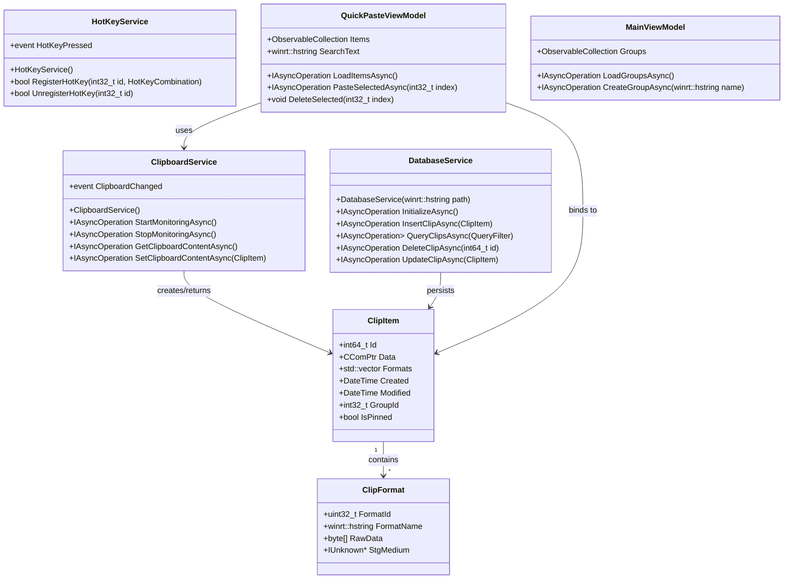
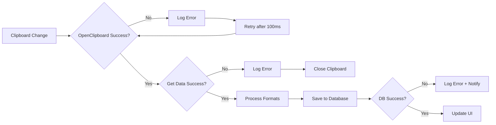

# Ditto WinUI 3 Migration - Technical Design

Feature Name: ditto-winui3-migration
Updated: 2026-03-28

## Description

本设计文档描述将 Ditto 剪贴板管理器从 MFC 架构迁移到 WinUI 3 的技术方案。迁移后的应用将使用现代化的 Windows 11 UI，同时保留所有现有的剪贴板管理功能。

### Project Overview

| Item | Value |
|------|-------|
| Project Name | Ditto (WinUI 3 Edition) |
| Project Type | Windows Desktop Application |
| Target Framework | WinUI 3 (C++/WinRT) |
| Target Platform | Windows 10 1809+ / Windows 11 |
| Architecture | MVVM with C++/WinRT |

## Architecture

### High-Level Architecture

```mermaid
graph TB
    subgraph "Presentation Layer (WinUI 3)"
        A["MainWindow<br/>(XAML)"]
        B["QuickPasteWindow<br/>(XAML)"]
        C["SettingsDialog<br/>(XAML)"]
        D["EditWindow<br/>(XAML)"]
    end

    subgraph "ViewModel Layer (C++/WinRT)"
        E["MainViewModel"]
        F["QuickPasteViewModel"]
        G["SettingsViewModel"]
        H["ClipEditorViewModel"]
    end

    subgraph "Service Layer (C++/WinRT)")
        I["ClipboardService"]
        J["DatabaseService"]
        K["HotKeyService"]
        L["SettingsService"]
        M["TrayIconService"]
    end

    subgraph "Data Layer"
        N["SQLite Database"]
        O["Registry/JSON Config"]
    end

    subgraph "Interop Layer"
        P["Win32 Clipboard Interop"]
        Q["Global HotKey Interop"]
        R["Window Station Interop"]
    end

    A --> E
    B --> F
    C --> G
    D --> H

    E --> I
    E --> J
    E --> K
    E --> L
    E --> M

    F --> I
    F --> J

    G --> L
    G --> N

    H --> J
    H --> N

    I --> P
    K --> Q
    M --> R
    J --> N
    L --> O
```

### Component Architecture



## Components and Interfaces

### 1. WinUI 3 XAML Components

#### MainWindow.xaml
- **Type**: `Microsoft::UI::Xaml::Controls::Window`
- **Features**: 
  - WinUI 3 NavigationView as main container
  - Mica backdrop material
  - Title bar with native window controls
  - System tray integration

#### QuickPasteWindow.xaml
- **Type**: `Microsoft::UI::Xaml::Controls::ContentDialog` or custom window
- **Features**:
  - Floating window with rounded corners
  - Real-time search ListView
  - Keyboard navigation support
  - Auto-hide on focus loss

#### SettingsDialog.xaml
- **Type**: `Microsoft::UI::Xaml::Controls::NavigationView`
- **Features**:
  - NavigationView with settings categories
  - Toggle switches for boolean options
  - ComboBox for enumerated settings
  - Slider for numeric values

### 2. ViewModels (C++/WinRT)

| ViewModel | Responsibilities |
|-----------|-----------------|
| `MainViewModel` | Application state, group management, tray icon |
| `QuickPasteViewModel` | Clip list, search, selection, paste operations |
| `SettingsViewModel` | Settings binding, validation, persistence |
| `ClipEditorViewModel` | Single clip editing, format selection |
| `GroupViewModel` | Group CRUD operations |

### 3. Services (C++/WinRT)

| Service | Win32 Interop | Description |
|---------|---------------|-------------|
| `ClipboardService` | `OpenClipboard`, `GetClipboardData` | Clipboard monitoring and manipulation |
| `DatabaseService` | SQLite C API | Data persistence |
| `HotKeyService` | `RegisterHotKey`, `UnregisterHotKey` | Global hotkey registration |
| `SettingsService` | Registry / JSON | Configuration management |
| `TrayIconService` | `Shell_NotifyIcon` | System tray integration |
| `ThemeService` | `SetWindowCompositionAttribute` | Mica/云母效果 |

### 4. Data Models

#### ClipItem
```cpp
struct ClipItem
{
    int64_t Id;
    std::vector<ClipFormat> Formats;
    Windows::Foundation::DateTime Created;
    Windows::Foundation::DateTime Modified;
    int32_t GroupId;
    bool IsPinned;
    winrt::hstring Description;
};
```

#### ClipFormat
```cpp
struct ClipFormat
{
    uint32_t FormatId;
    winrt::hstring FormatName;
    std::vector<byte> RawData;
    Windows::Storage::Streams::IBuffer^ Buffer;
};
```

### 5. Key Interfaces

```cpp
// IClipboardService
struct IClipboardService
{
    virtual IAsyncOperation<bool> StartMonitoringAsync() = 0;
    virtual IAsyncOperation<void> StopMonitoringAsync() = 0;
    virtual IAsyncOperation<ClipItem> GetClipboardContentAsync() = 0;
    virtual IAsyncOperation<void> SetClipboardContentAsync(ClipItem) = 0;
    virtual event_token ClipboardChanged(EventHandler<ClipItem>);
    virtual void RemoveClipboardChanged(event_token);
};

// IDatabaseService  
struct IDatabaseService
{
    virtual IAsyncOperation<void> InitializeAsync() = 0;
    virtual IAsyncOperation<int64_t> InsertClipAsync(ClipItem) = 0;
    virtual IAsyncOperation<std::vector<ClipItem>> QueryClipsAsync(QueryFilter) = 0;
    virtual IAsyncOperation<void> UpdateClipAsync(ClipItem) = 0;
    virtual IAsyncOperation<void> DeleteClipAsync(int64_t) = 0;
};

// IHotKeyService
struct IHotKeyService
{
    virtual bool RegisterHotKey(int32_t, HotKeyCombination) = 0;
    virtual bool UnregisterHotKey(int32_t) = 0;
    virtual event_token HotKeyPressed(EventHandler<int32_t>);
    virtual void RemoveHotKeyPressed(event_token);
};
```

## Correctness Properties

### Invariants

1. **Clipboard Monitoring**: At most one clipboard monitoring session exists at any time.
2. **Database Consistency**: All ClipItems in memory have a corresponding database record.
3. **HotKey Uniqueness**: No two different actions share the same hotkey combination.
4. **Thread Safety**: All service operations are thread-safe using WinRT async patterns.

### Constraints

1. **Memory**: Maximum 100MB memory footprint during idle state.
2. **Latency**: Quick paste window must appear within 50ms of hotkey press.
3. **Storage**: Support at least 10,000 clip items without degradation.
4. **Compatibility**: Must run on Windows 10 1809 and later.

## Error Handling

### Error Categories

| Category | Handling Strategy |
|----------|-------------------|
| Clipboard Access Failure | Log error, retry once, skip item if persistent |
| Database Error | Log error, show notification, disable persistence |
| HotKey Conflict | Show dialog to user, prompt for alternative |
| Plugin Error | Disable plugin, log error, continue operation |
| Out of Memory | Purge oldest items, show warning notification |

### Exception Flow



## Test Strategy

### Unit Testing

- **ViewModel Tests**: MVVM binding verification
- **Service Tests**: Mock clipboard, database for isolation
- **Format Parser Tests**: Each format aggregator unit tests

### Integration Testing

- **End-to-End Clipboard Flow**: Capture -> Store -> Display -> Paste
- **Database Round-Trip**: Insert -> Query -> Update -> Delete
- **HotKey Registration**: Register -> Trigger -> Unregister

### UI Testing

- **WinUI 3 Component Tests**: XAML UI automation
- **Theme Tests**: Light/Dark mode switching
- **Localization Tests**: String resource loading

## Implementation Phases

### Phase 1: Project Setup
1. Create new WinUI 3 project using `cppwinrt` template
2. Set up project structure (MVVM folders)
3. Configure MSIX packaging
4. Add NuGet dependencies (SQLite, etc.)

### Phase 2: Core Infrastructure
1. Implement `IDatabaseService` with SQLite
2. Implement `ISettingsService`
3. Implement `IClipboardService` with Win32 interop
4. Implement `IHotKeyService` with Win32 interop

### Phase 3: ViewModels
1. Create base `ViewModel` class with `INotifyPropertyChanged`
2. Implement `MainViewModel`
3. Implement `QuickPasteViewModel`
4. Implement `SettingsViewModel`

### Phase 4: UI (XAML)
1. Create MainWindow with NavigationView
2. Create QuickPasteWindow with ListView
3. Create SettingsDialog with categories
4. Implement WinUI 3 styling (Mica, rounded corners)

### Phase 5: Integration
1. Connect ViewModels to Services
2. Implement tray icon
3. Add global hotkey handling
4. Implement theme switching

### Phase 6: Polish
1. Add animations and transitions
2. Optimize performance
3. Add accessibility support
4. Test on Windows 10/11

## File Structure

```
DittoWinUI/
├── DittoWinUI/                      # Main project
│   ├── App.xaml
│   ├── App.xaml.cpp
│   ├── MainWindow.xaml
│   ├── MainWindow.xaml.cpp
│   │
│   ├── ViewModels/                  # MVVM ViewModels
│   │   ├── ViewModelBase.h/cpp
│   │   ├── MainViewModel.h/cpp
│   │   ├── QuickPasteViewModel.h/cpp
│   │   ├── SettingsViewModel.h/cpp
│   │   └── ClipEditorViewModel.h/cpp
│   │
│   ├── Views/                       # XAML Views
│   │   ├── QuickPasteWindow.xaml
│   │   ├── SettingsDialog.xaml
│   │   ├── EditWindow.xaml
│   │   └── Controls/
│   │       ├── ClipItemControl.xaml
│   │       └── GroupTreeControl.xaml
│   │
│   ├── Services/                    # Business logic
│   │   ├── IClipboardService.h
│   │   ├── ClipboardService.h/cpp
│   │   ├── IDatabaseService.h
│   │   ├── DatabaseService.h/cpp
│   │   ├── IHotKeyService.h
│   │   ├── HotKeyService.h/cpp
│   │   ├── ISettingsService.h
│   │   ├── SettingsService.h/cpp
│   │   └── TrayIconService.h/cpp
│   │
│   ├── Models/                      # Data models
│   │   ├── ClipItem.h
│   │   ├── ClipFormat.h
│   │   ├── ClipGroup.h
│   │   └── QueryFilter.h
│   │
│   ├── Interop/                    # Win32 interop
│   │   ├── ClipboardInterop.h/cpp
│   │   ├── HotKeyInterop.h/cpp
│   │   └── ThemeInterop.h/cpp
│   │
│   ├── Converters/                 # XAML converters
│   │   ├── BoolToVisibilityConverter.h
│   │   └── DateTimeConverter.h
│   │
│   ├── Resources/                  # Assets
│   │   ├── Strings.resw
│   │   ├── Themes/
│   │   └── Icons/
│   │
│   └── Package.appxmanifest
│
├── DittoCore/                       # Core library (can be reused)
│   ├── Models/
│   ├── Database/
│   └── FormatAggregators/
│
└── DittoWinUI.sln
```

## References

- [WinUI 3 Documentation](https://learn.microsoft.com/en-us/windows/apps/winui/)
- [C++/WinRT](https://learn.microsoft.com/en-us/windows/uwp/cpp-and-winrt-apis/)
- [MVVM with WinUI 3](https://learn.microsoft.com/en-us/windows/apps/develop/mvvm/)
- [Windows App SDK](https://learn.microsoft.com/en-windows/apps/windows-app-sdk/)
